# MonoBufferEd - AmbienceCreatorFinalProject
This is the stable Mono Buffer (single sample) version of my project patch.

*Last tested December 14th*

## Folder contents
The contents of the folder will look like this:
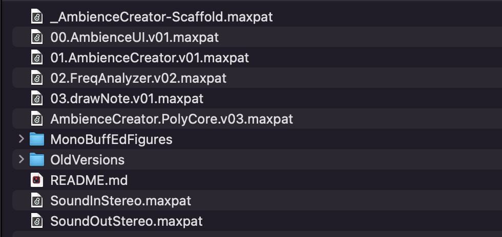

The **OldVersions** folder contains older versions of the project and inner patches that were made en route to the final version. The **MonoBuffEdFigures** folder can be ignored as it only contains the images for this README file. 

# Quick Start: How to use
- 1) Open the scaffold **_AmbienceCreator-Scaffold.maxpat**. There are instructions also written directly into this patch.

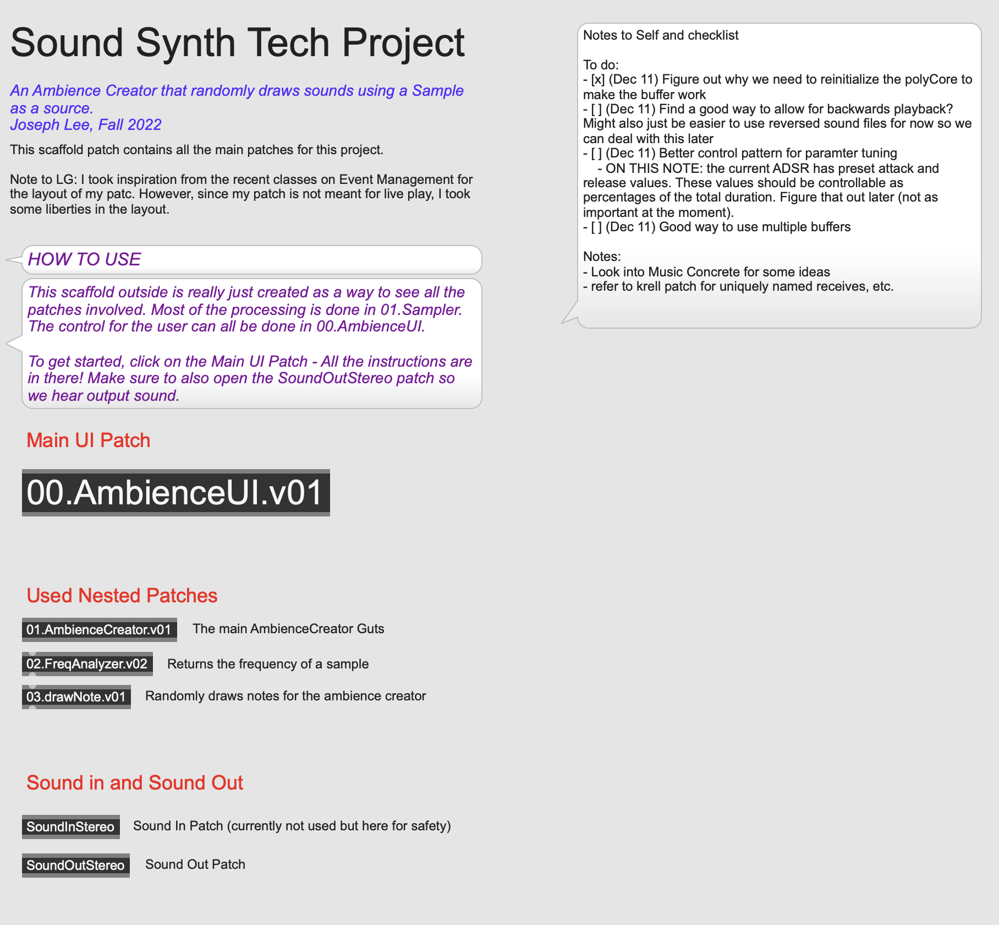

- 2) Open the main UI interface (**00.AmbienceUI.v01.maxpat**) as well as the sound out patch (**SoundOutStereo.maxpat**). Thic can all be done from the scaffold by clicking on the patch abstractions.
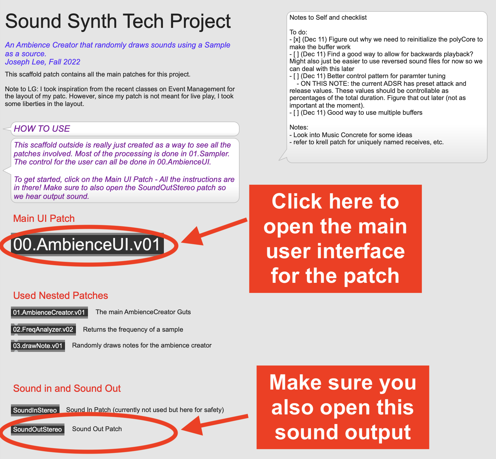

- The UI and Sound Out patches will look like this: 

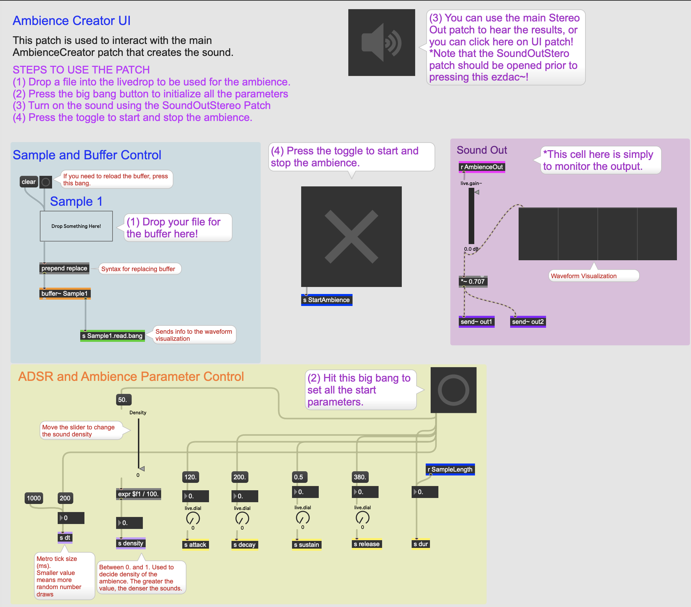

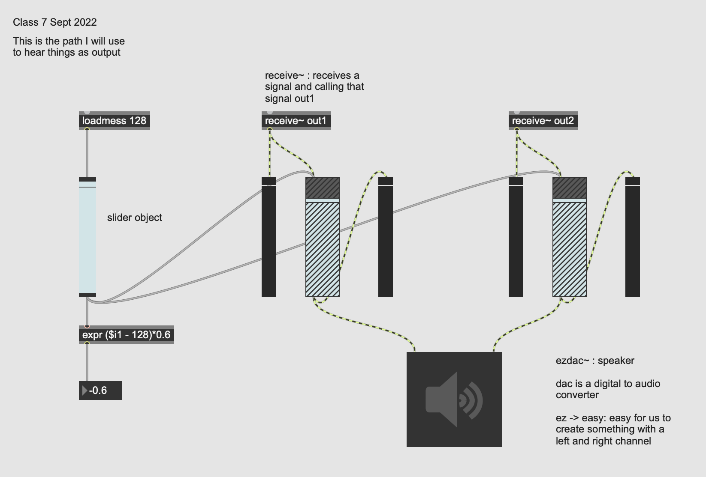

Instructions for patch use are also laid out in the UI interface.

- 3) Inside of the UI interace, drop the desired sample into the *live.drop* object. 

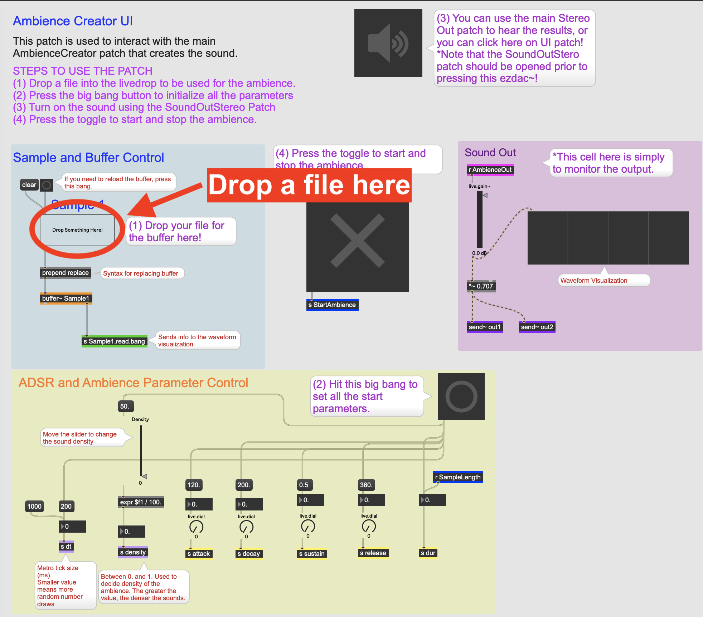
- 4) Hit the large *bang* button in the yellow panel.

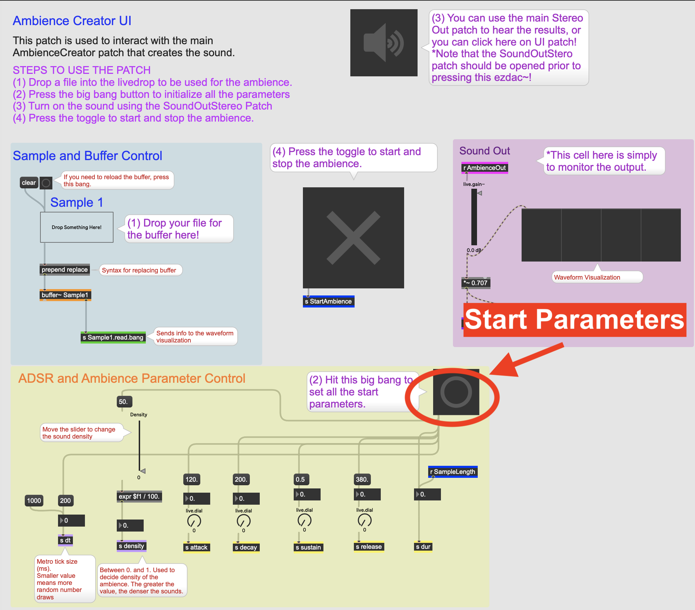

- 5) Turn on audio either using the ezdac~ in the UI or in the SoundOutStereo patch. Note that if you use the UI ezdac~, *you must make sure that the SoundOutStereo patch is open*.
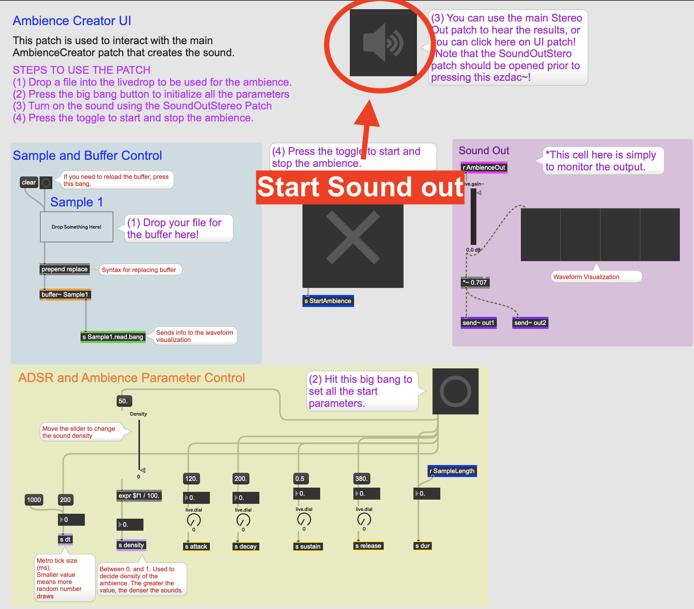
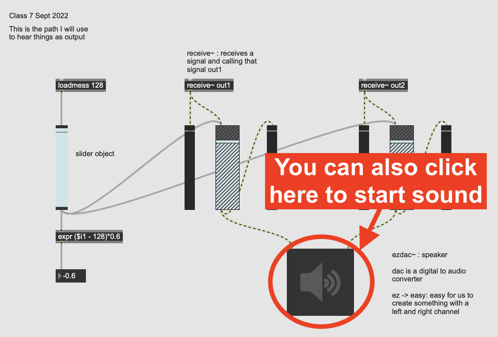

- 6) Press the *toggle* to start the sound.
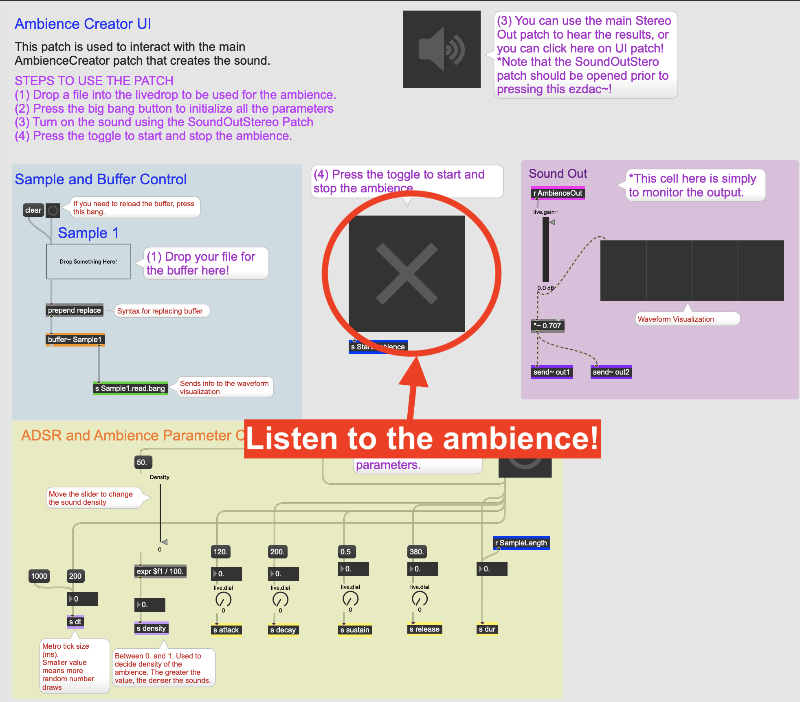
- 7) Enjoy the randomized ambience. You may control the parameters of the ambience using the *ADSR and Ambience Control* panel in yellow. 
- 8) If you would like the change files, you can drop a new sample in the *live.drop*. This should start working immediately, but feel free to press the bang in the *Sample and Buffer Control* panel as well as the large bang in the *ADSR and Ambience Parameter Control* panel for safety. 

## Controlling Parameters
The main panel to control the ambience is the yellow panel at the bottom.
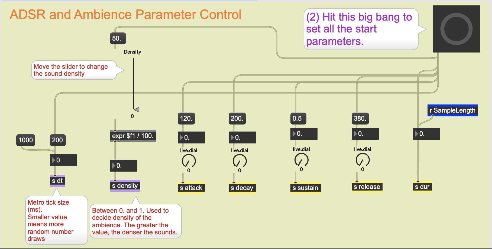

We will describe the inputs from left to right

- **dt**: controls how often we draw a new random number. This is arbitrarily set to 200 ms, but can be adjusted if you want to finer or coarser grain.
- **density**: The density value indicates how much sound plays by lowering the threshold for starting another random value. By default, it is set to 50/100. A higher density means the ambience will have more sound, and a lower density means the ambience will be sparser. Thi can be controlled with the *live.slider*.
- **ADSR parameters**: the next four, *attack, decay, sustain, release* are ADSR parameters.
    - **Attack**: controls the attack of the envelope (in ms). This can be adjusted with the live.dial.
    - **Decay**: controls the decay of the envelope (in ms). This can be adjusted with the live.dial.
    - **Sustain**: controls the amplitude of the sustain, taking a value between 0 and 1. *NOTE: the sustain is actually controlled by each random sound created, so this currently does nothing and is only kept for future projects and uses.*
    - **Release**: controls the release of the envelope (in ms). This can be adjusted with the live.dial.
- **dur**: (duration) is set by the length of the sample. *This should not be changed!*

# Patch Descriptions

## Scaffold Patch
The scaffold patch should look like this:

Upon opening the patch, you will see abstractions for all the patches that are used. If you are interested in how the patch itself works, you can navigate to the *Used Nested Patches*.
- **01.AmbienceCreator**: This is the main "guts" of the patch that takes the sample info to create the sound using poly~.
- **02.FreqAnalyzer**: This patch is working but currently not used. It "listens" to the sample in order to find the pitch of the sample. Note that this really only works if you sample is pitched and consistent.
- **03.drawNote**: This patch is contained within the **01.AmbienceCreator** and is used to randomly draw the notes that are played back in the poly. It controls the playback speed, volume, and pitch shift.

For sound output refer to th the *Sound In and Sound Out*:
- **SoundOutStereo**: This is the main sound out patch that is used to hear anything.
- **SoundInStereo**: This patch would be the sound input, but actually is not used at all in this patch.

