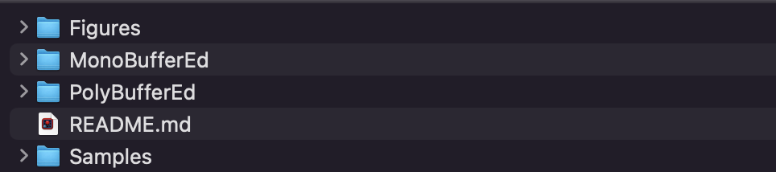

# AmbienceCreatorFinalProject
Final Project for Sound Synth Tech Class (Fall 2022)

This patch was created for my final project for the Sound Synth Tech class in Fall 2022. The goal of the project is to create an **Ambience Creator**. Given some samples, the patch will use a poly~ to create an ambience using that sound.

The idea for this came from a piece I wrote in which I manually placed samples in an "organized" random way. There are times when this is necessary (which could be done with a sample instrument), but there are times when complete randomness is fine. 

### Note to LG:
*For grading purposes*, I am mainly submitted the **MonoBufferEd** since this version is tested and stable (to my knowledge). The **PolyBufferEd** is still in progress and probably not very far by the time you're seeing this!

## Repo Contents
There are three main folders in the repository
- **MonoBufferEd**: This contains a drag-and-drop single sample/buffer version of the patch. It was tested to work on December 14th (stable). 
- **PolyBufferEd**: This contains a multibuffer version that will read the contents of a Samples folder. This is the current *unstable* 
- **Samples**: This folder contains the samples that can either be drag-and-dropped into the MonoBufferEd or it can be 
- **Figures**: Nothing too important in this folder. It simply contains screenshots of the patch layout and folder layout for the user to refer to. These images are embedded in the README.md files.

## How to use this patch
Please refer to the README.md files contained in the **MonoBufferEd** and **PolyBufferEd**. You can start by clicking on the folder of the version you would like to use and refer to the respective README.md files. 

## Differences between Mono and Poly buffer editions of the patch
- Dec 18: Recently made a copy for PolyBuffer. The [dt] in the main patch was now changed for BPM.

## To Do List After Submission
Here are a list of things that need to be done later on. I was unable to finish these before the class submission. (Unless they are checked. That means I somehow got it in.)
- [ ] **Interface with Logic**: find a way to make this a logic patcch for easier use
- [ ] **Finish Pitching**: Rather than using a random pitchshiftcent distribution, use the frequency analyzer to figure out the tonal center and then make the pitchshiftcent follow a given note distribution (i.e. draw 1st, 2nd, 7th scale degree most)
- [ ] **Multiple Sample Support**: Allow multiple samples to be used. This should be done by making a patch where you can livedrop all of the paths for buffers.
- [ ] **BPM Rhythmic Support**: Fix a BPM and time signature such that the ambience isn't just completely random.
- [ ] **Built in Naive Reverb/EQ**: Logic and other DAWs have very strong reverb tools, but adding a control for Reverb and EQ could be a nice touch (at leat pedagogically).
- [ ] **Reverse Play**: Use a sel object for reverse play. 

